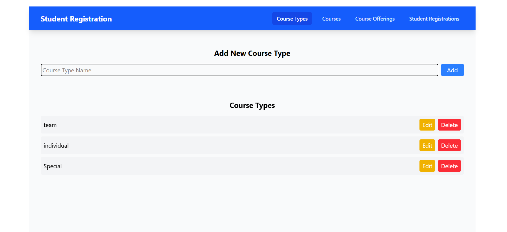
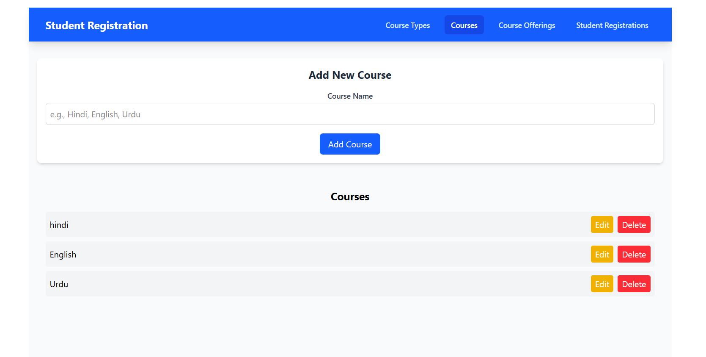
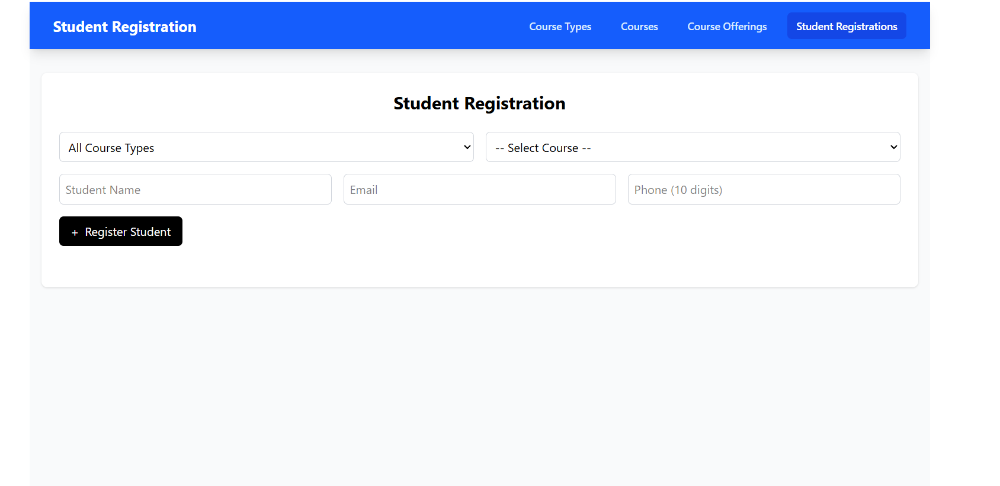

# 🎓 Student Registration System

Welcome to the **Student Registration System**, a modern web application to streamline student enrollments, manage course types, create courses, and handle course offerings with ease! Built using the latest frontend tools like **React.js**, **Tailwind CSS**, and **React Router**, this app ensures a smooth and responsive experience.

🚀 **[Live Demo on Vercel](https://student-registration-system-o7ji.vercel.app/)**

---

## ✨ Key Features

🗂️ **Course Types**  
→ Create, edit, and delete different types of courses like Online, Offline, Hybrid, etc.

📚 **Courses**  
→ Add new courses and associate them with course types.

📅 **Course Offerings**  
→ Schedule courses with date, batch, and availability to manage offerings.

📝 **Student Registrations**  
→ Register students under specific course offerings.  
→ View and filter registrations by course type or offering.

🔍 **Filter & View**  
→ Easily view all offerings or registrations based on selected course types.

---

## 🛠 Tech Stack

| 🔧 Tool               | 📋 Description                    |
|----------------------|-----------------------------------|
| ⚛️ React.js           | Frontend Library                  |
| 🎨 Tailwind CSS       | Utility-first CSS Framework       |
| 🧭 React Router DOM   | Client-side Routing               |
| 🧩 React UI Libraries | Pre-built UI Components           |

---

## 📸 Screenshots

> Make sure to add your screenshots inside a `screenshots/` folder at the root of the project.

| 🏠 Home Page | 🧾 Course Types |
|-------------|-----------------|
|  |  |

| 📅 Offerings | 🧑‍🎓 Registrations |
|-------------|--------------------|
|  |  |

---

## 🧑‍💻 Getting Started

To run this project locally, follow these steps:

```bash
git clone https://github.com/your-username/student-registration-system.git
cd student-registration-system
npm install
npm run dev
